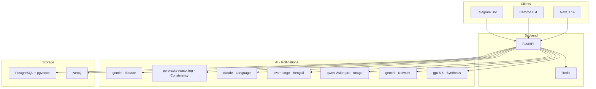

# TrustLens — Implementation Progress & Plan

> **Last Updated:** 2026-05-24 | **Status:** Phase 1 — Foundation | **Deadline:** May 30, 2026

---

## Progress Tracker

| # | Task | Status | Phase |
|---|------|--------|-------|
| 1A | Monorepo scaffold | ⬜ | 1 |
| 1B | Backend foundation (FastAPI + config + models) | ⬜ | 1 |
| 1C | Pollinations API client + Redis caching | ⬜ | 1 |
| 1D | Pillar 2 - Content Consistency | ⬜ | 1 |
| 1E | Pillar 3 - Language Analysis | ⬜ | 1 |
| 1F | POST /api/analyze endpoint | ⬜ | 1 |
| 1G | Frontend scaffold (Next.js 14 + Tailwind + fonts) | ⬜ | 1 |
| 1H | InputForm component | ⬜ | 1 |
| 1I | TrustGauge component | ⬜ | 1 |
| 1J | PillarCard components | ⬜ | 1 |
| 1K | Results page + scan animation | ⬜ | 1 |
| 1L | Docker Compose | ⬜ | 1 |
| 2A | Pillar 1 - Source Reputation | ⬜ | 2 |
| 2B | Pillar 4 - Bengali Context | ⬜ | 2 |
| 2C | Pillar 5 - Image Authenticity | ⬜ | 2 |
| 2D | Pillar 6 - Author/Network | ⬜ | 2 |
| 2E | Score synthesis via gpt-5.5 | ⬜ | 2 |
| 2F | RAG pipeline (chunking + pgvector) | ⬜ | 2 |
| 2G | Neo4j Graph RAG | ⬜ | 2 |
| 2H | RadarChart component | ⬜ | 2 |
| 2I | LanguageToggle + i18n | ⬜ | 2 |
| 2J | Full results page with evidence | ⬜ | 2 |
| 3A | Telegram bot | ⬜ | 3 |
| 3B | Chrome extension | ⬜ | 3 |
| 3C | n8n workflows | ⬜ | 3 |
| 4A | VPS deployment | ⬜ | 4 |
| 4B | Nginx + SSL | ⬜ | 4 |
| 4C | Final testing + submission | ⬜ | 4 |

---

## Architecture

---

## Phase 1 Detailed Specs

### 1A — Monorepo Scaffold

Create full directory tree per CLAUDE.md architecture section. Key files:

**Root:** `docker-compose.yml`, `.env.example`, `.gitignore`, `README.md`

**Backend:** FastAPI app under `backend/app/` with submodules: `api/`, `core/pillars/`, `core/rag/`, `services/`, `models/`

**Frontend:** Next.js 14 App Router under `frontend/` with: `app/`, `components/`, `lib/`, `public/`

---
